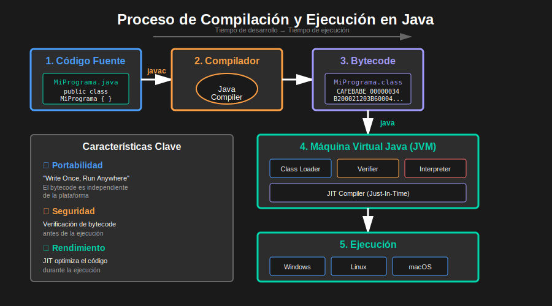
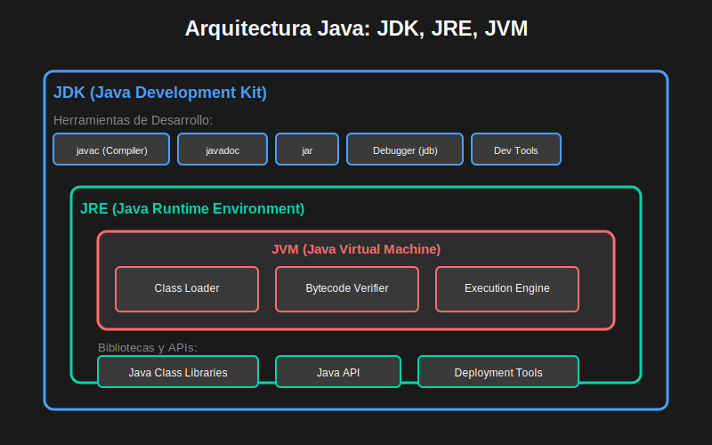

# 01 - Introducción a Java

## 📚 ¿Qué es Java?

Java es un lenguaje de programación de alto nivel, orientado a objetos y de propósito general, creado por **James Gosling** en **Sun Microsystems** (ahora Oracle) en 1995.

### 🎯 Características Principales

#### 1. **Simple y Familiar**
- Sintaxis inspirada en C y C++
- Elimina características complejas (punteros, herencia múltiple)
- Gestión automática de memoria (Garbage Collection)

#### 2. **Orientado a Objetos**
- Todo es un objeto (excepto primitivos)
- Encapsulación, herencia y polimorfismo
- Reutilización de código

#### 3. **Independiente de Plataforma** ☕
- **"Write Once, Run Anywhere" (WORA)**
- Código compilado a bytecode
- Ejecutado en cualquier JVM

```
Código Java (.java) → Compilador → Bytecode (.class) → JVM → Ejecución
```



#### 4. **Robusto y Seguro**
- Fuertemente tipado
- Manejo de excepciones
- Verificación de bytecode
- Sin punteros explícitos

#### 5. **Multithreading**
- Soporte nativo para programación concurrente
- Gestión de múltiples hilos de ejecución

#### 6. **Alto Rendimiento**
- Compilación JIT (Just-In-Time)
- Optimizaciones en tiempo de ejecución

---

## 🏛️ Historia de Java

### Línea de Tiempo Completa

| Año | Versión | Destacado |
|-----|---------|-----------|
| **1995** | Java 1.0 | 🎉 Lanzamiento inicial - "Oak" |
| **1996** | Java 1.1 | Inner classes, JavaBeans, JDBC |
| **1998** | Java 2 (J2SE 1.2) | Swing, Collections Framework |
| **2000** | Java 1.3 | HotSpot JVM, JNDI |
| **2002** | Java 1.4 | Assert, Regex, NIO |
| **2004** | Java 5 (1.5) | 🌟 Generics, Enums, Autoboxing, For-each |
| **2006** | Java 6 | Scripting, JDBC 4.0, mejoras de performance |
| **2011** | Java 7 | Try-with-resources, Diamond operator, Strings en switch |
| **2014** | Java 8 LTS | 🔥 Lambdas, Stream API, Optional, Date/Time API |
| **2017** | Java 9 | Project Jigsaw (Módulos), JShell, HTTP/2 Client |
| **2018** | Java 10 | `var` para inferencia de tipos locales |
| **2018** | Java 11 LTS | HTTP Client, String methods, `var` en lambdas |
| **2019** | Java 12 | Switch expressions (preview), Shenandoah GC |
| **2019** | Java 13 | Text blocks (preview), mejoras en switch |
| **2020** | Java 14 | Records (preview), Pattern matching (preview) |
| **2020** | Java 15 | Text blocks, Sealed classes (preview) |
| **2021** | Java 16 | Records, Pattern matching for instanceof |
| **2021** | Java 17 LTS | ⭐ Sealed classes, Pattern matching, Records estables |
| **2022** | Java 18 | UTF-8 por defecto, Simple Web Server |
| **2022** | Java 19 | Virtual Threads (preview), Pattern matching mejoras |
| **2023** | Java 20 | Scoped Values (preview), Record patterns |
| **2023** | Java 21 LTS | 🚀 Virtual Threads, Pattern Matching mejorado, Sequenced Collections |
| **2024** | Java 22 | Unnamed variables, FFM (Foreign Function & Memory) API |
| **2024** | Java 23 | Primitive types in patterns, Module import declarations |
| **2025** | Java 24 | Stream Gatherers, mejoras en performance |

### 📊 Ciclo de Releases

**Desde Java 9 (2017):**
- 🗓️ Nueva versión cada **6 meses** (marzo y septiembre)
- 🔒 Versión **LTS** cada **3 años** (soporte extendido)
- ⚡ Versiones intermedias con soporte de **6 meses**

### 🏆 Versiones LTS (Long-Term Support)

| Versión | Lanzamiento | Fin de Soporte | Estado |
|---------|-------------|----------------|--------|
| Java 8 | Marzo 2014 | Diciembre 2030 | 🟢 Activo |
| Java 11 | Septiembre 2018 | Septiembre 2026 | 🟢 Activo |
| Java 17 | Septiembre 2021 | Septiembre 2029 | 🟢 Activo |
| Java 21 | Septiembre 2023 | Septiembre 2031 | 🟢 Activo |
| Java 25 | Septiembre 2025 | Septiembre 2033 | 🔵 Próxima |

### 💡 Dato Curioso

Java originalmente se llamaba **"Oak"** (roble) por un árbol que estaba fuera de la oficina de James Gosling. El nombre cambió a **"Java"** por el café de Java, Indonesia.

---

## ⚙️ Componentes del Ecosistema Java

### 1. JDK (Java Development Kit)

**Kit de Desarrollo de Java** - Todo lo necesario para desarrollar aplicaciones Java.

**Incluye:**
- ☕ Compilador (`javac`)
- 🚀 JRE (Java Runtime Environment)
- 🛠️ Herramientas de desarrollo
- 📚 Bibliotecas estándar
- 📖 Documentación

```bash
# Verificar instalación del JDK
javac -version
```

### 2. JRE (Java Runtime Environment)

**Entorno de Ejecución de Java** - Necesario para ejecutar aplicaciones Java.

**Incluye:**
- 🔧 JVM (Java Virtual Machine)
- 📚 Bibliotecas de clases estándar
- 🔌 Componentes de soporte

```bash
# Verificar instalación del JRE
java -version
```

### 3. JVM (Java Virtual Machine)

**Máquina Virtual de Java** - Motor que ejecuta el bytecode Java.

**Funciones:**
- 📜 Interpreta bytecode
- ⚡ Compilación JIT
- 🗑️ Garbage Collection
- 🔒 Gestión de seguridad
- 💾 Gestión de memoria

### 📊 Diagrama de Relación



```
┌─────────────────────────────────────┐
│             JDK                     │
│  ┌───────────────────────────────┐ │
│  │           JRE                 │ │
│  │  ┌─────────────────────────┐ │ │
│  │  │         JVM             │ │ │
│  │  │  - Interpreta bytecode  │ │ │
│  │  │  - Garbage Collection   │ │ │
│  │  └─────────────────────────┘ │ │
│  │  + Bibliotecas de clases     │ │
│  └───────────────────────────────┘ │
│  + Compilador (javac)              │
│  + Herramientas de desarrollo      │
└─────────────────────────────────────┘
```

---

## 🎯 ¿Por qué Aprender Java?

### ✅ Ventajas

1. **📈 Demanda Laboral**
   - Uno de los lenguajes más solicitados
   - Salarios competitivos
   - Múltiples oportunidades

2. **🌐 Versatilidad**
   - Aplicaciones web (Spring, Jakarta EE)
   - Aplicaciones móviles (Android)
   - Aplicaciones de escritorio
   - Sistemas empresariales
   - Big Data (Hadoop, Spark)

3. **👥 Comunidad Grande**
   - Documentación extensa
   - Millones de desarrolladores
   - Abundancia de recursos

4. **📚 Fundamentos Sólidos**
   - Excelente para aprender POO
   - Base para otros lenguajes (C#, Kotlin)
   - Prácticas de programación establecidas

5. **🔧 Ecosistema Maduro**
   - Miles de bibliotecas
   - Frameworks robustos
   - Herramientas de desarrollo

---

## 💼 Casos de Uso

### Dónde se Usa Java

- **🏦 Banca y Finanzas**: Sistemas transaccionales
- **📱 Android**: Aplicaciones móviles
- **🌐 Web**: Backend de aplicaciones empresariales
- **🎮 Gaming**: Minecraft (Bedrock Edition en C++, pero muchos mods en Java)
- **📊 Big Data**: Procesamiento de grandes volúmenes
- **🤖 IoT**: Internet de las Cosas
- **☁️ Cloud**: Aplicaciones en la nube

### Empresas que Usan Java

- Google
- Amazon
- Netflix
- Uber
- Airbnb
- LinkedIn
- Twitter
- Spotify

---

## 🆚 Java vs Otros Lenguajes

| Característica | Java | Python | C++ |
|----------------|------|--------|-----|
| **Tipado** | Fuerte/Estático | Fuerte/Dinámico | Fuerte/Estático |
| **Paradigma** | OOP | Multi-paradigma | Multi-paradigma |
| **Velocidad** | Rápido | Medio | Muy rápido |
| **Curva de aprendizaje** | Media | Fácil | Difícil |
| **Gestión de memoria** | Automática (GC) | Automática | Manual |
| **Multiplataforma** | Sí (JVM) | Sí (intérprete) | Compilación por SO |

---

## 📦 Versiones de Java en 2025

### Tipos de Releases

1. **LTS (Long-Term Support)** 🔒
   - Soporte extendido de **8 años** mínimo
   - Actualizaciones de seguridad garantizadas
   - Recomendado para producción
   - Ejemplos: Java 8, 11, 17, 21, (25 próximo)

2. **Non-LTS (Feature Releases)** ⚡
   - Soporte por **6 meses** únicamente
   - Características experimentales
   - Para pruebas y experimentación
   - Ejemplos: Java 18, 19, 20, 22, 23, 24

### ¿Cuál Versión Usar en 2025?

#### Para Aprender (Este Bootcamp)
**Java 21 LTS** ⭐ Recomendado
- Versión LTS más reciente estable
- Virtual Threads para concurrencia moderna
- Pattern Matching mejorado
- Records y Sealed classes
- Todas las características modernas de Java

**Alternativa: Java 17 LTS**
- También excelente para aprender
- Ampliamente usado en la industria
- Todas las características esenciales

#### Para Producción
- **Java 21 LTS**: Proyectos nuevos
- **Java 17 LTS**: Proyectos existentes (muy usado)
- **Java 11 LTS**: Legado, aún con soporte hasta 2026
- **Java 8 LTS**: Legado extendido, soporte hasta 2030

#### Para Experimentación
- **Java 24**: Última versión con features experimentales

### 🎯 Recomendación para este Bootcamp

Usaremos **Java 21 LTS** porque:
- ✅ Es la versión LTS más moderna
- ✅ Incluye todas las mejoras desde Java 8
- ✅ Prepara para el futuro del desarrollo Java
- ✅ Sintaxis más limpia y expresiva
- ✅ Mejor rendimiento y herramientas

---

## 🎓 Conceptos Clave

### Write Once, Run Anywhere (WORA)

```java
// Windows, Linux, macOS → mismo código
public class HolaMundo {
    public static void main(String[] args) {
        System.out.println("¡Hola Mundo!");
    }
}
```

### Compilación vs Interpretación

**Java usa ambos:**

1. **Compilación** (javac):
   ```
   HolaMundo.java → HolaMundo.class (bytecode)
   ```

2. **Interpretación + JIT** (JVM):
   ```
   HolaMundo.class → Código máquina nativo
   ```

---

## 🔍 Resumen

| Concepto | Descripción |
|----------|-------------|
| **Java** | Lenguaje OOP, multiplataforma, robusto |
| **JDK** | Kit completo de desarrollo |
| **JRE** | Entorno para ejecutar aplicaciones |
| **JVM** | Máquina virtual que ejecuta bytecode |
| **WORA** | Escribe una vez, ejecuta en cualquier lugar |
| **Bytecode** | Código intermedio independiente de plataforma |

---

## 📚 Recursos Adicionales

- [Oracle Java Documentation](https://docs.oracle.com/en/java/)
- [Java Tutorials (Oracle)](https://docs.oracle.com/javase/tutorial/)
- [OpenJDK](https://openjdk.org/)
- [Java Wikipedia](https://es.wikipedia.org/wiki/Java_(lenguaje_de_programaci%C3%B3n))

---

## ✅ Autoevaluación

Después de leer este contenido, deberías poder responder:

1. ¿Qué significa WORA?
2. ¿Cuál es la diferencia entre JDK, JRE y JVM?
3. ¿Por qué Java es independiente de plataforma?
4. ¿Qué es el bytecode?
5. ¿Cuáles son las principales características de Java?

---

[⬅️ Volver a Semana 0](../README.md) | [➡️ Siguiente: Sintaxis Básica](02-sintaxis-basica.md)
