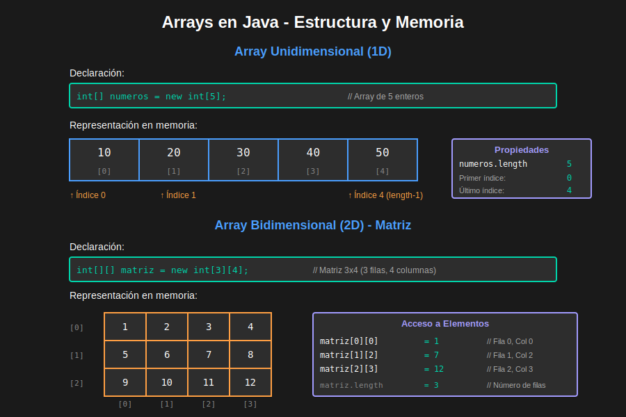

# 06 - Arrays (Arreglos)

Un **array** es una estructura de datos que almacena múltiples valores del mismo tipo en una sola variable.



---

## 📦 ¿Qué es un Array?

- Colección de elementos del mismo tipo
- Tamaño fijo (definido al crear el array)
- Acceso mediante índices (comienzan en 0)
- Almacenados en memoria de forma contigua

### 🎯 Características

| Característica | Descripción |
|----------------|-------------|
| **Tipo homogéneo** | Todos los elementos del mismo tipo |
| **Tamaño fijo** | No puede cambiar una vez creado |
| **Índice basado en 0** | Primer elemento en posición 0 |
| **Acceso directo** | O(1) para acceder a cualquier elemento |

---

## 🛠️ Declaración de Arrays

### Sintaxis

```java
// Forma 1: Declaración y luego creación
tipo[] nombreArray;
nombreArray = new tipo[tamaño];

// Forma 2: Declaración y creación en una línea
tipo[] nombreArray = new tipo[tamaño];

// Forma 3: Declaración, creación e inicialización
tipo[] nombreArray = {valor1, valor2, valor3, ...};
```

### 📝 Ejemplos de Declaración

```java
// Arrays de diferentes tipos
int[] numeros;                          // Declaración
numeros = new int[5];                   // Creación (5 elementos)

double[] precios = new double[10];      // Declaración + creación

String[] nombres = new String[3];       // Array de objetos

boolean[] flags = new boolean[4];       // Array de booleanos

// Inicialización directa
int[] edades = {18, 20, 25, 30, 35};
String[] dias = {"Lunes", "Martes", "Miércoles"};
double[] notas = {8.5, 9.0, 7.5, 6.0};
```

### ⚠️ Formas Alternativas (menos comunes)

```java
// También válido (pero menos usado)
int numeros[];
String nombres[];

// Recomendado
int[] numeros;
String[] nombres;
```

---

## 🔢 Acceso a Elementos

### Índices

Los arrays usan índices que comienzan en **0**.

```java
int[] numeros = {10, 20, 30, 40, 50};

// Índice:        0   1   2   3   4
// Valor:        10  20  30  40  50
```

### Acceso Lectura

```java
int[] numeros = {10, 20, 30, 40, 50};

System.out.println(numeros[0]);  // 10
System.out.println(numeros[2]);  // 30
System.out.println(numeros[4]);  // 50

// Último elemento
int ultimo = numeros[numeros.length - 1];  // 50
```

### Acceso Escritura

```java
int[] numeros = new int[5];

numeros[0] = 10;
numeros[1] = 20;
numeros[2] = 30;
numeros[3] = 40;
numeros[4] = 50;

// Modificar valores
numeros[2] = 100;  // Cambia 30 por 100
```

### ⚠️ Errores Comunes

```java
int[] numeros = new int[5];

// ❌ ArrayIndexOutOfBoundsException
System.out.println(numeros[5]);   // Error: índice 5 no existe
System.out.println(numeros[-1]);  // Error: índice negativo

// ✅ Correcto
System.out.println(numeros[4]);   // Último elemento (índice 4)
System.out.println(numeros[0]);   // Primer elemento
```

---

## 📏 Propiedad length

Obtiene el tamaño del array.

```java
int[] numeros = {10, 20, 30, 40, 50};
System.out.println("Tamaño: " + numeros.length);  // 5

String[] nombres = new String[10];
System.out.println("Tamaño: " + nombres.length);  // 10

// Último elemento
int ultimo = numeros[numeros.length - 1];

// Verificar si está vacío
if (numeros.length == 0) {
    System.out.println("Array vacío");
}
```

---

## 🔄 Recorrer Arrays

### 1. Bucle for Tradicional

```java
int[] numeros = {10, 20, 30, 40, 50};

// Recorrer con índice
for (int i = 0; i < numeros.length; i++) {
    System.out.println("Posición " + i + ": " + numeros[i]);
}

// Recorrer al revés
for (int i = numeros.length - 1; i >= 0; i--) {
    System.out.println(numeros[i]);
}
```

### 2. Bucle for-each (Enhanced for)

```java
int[] numeros = {10, 20, 30, 40, 50};

// Más simple y legible
for (int numero : numeros) {
    System.out.println(numero);
}

String[] frutas = {"Manzana", "Pera", "Uva"};
for (String fruta : frutas) {
    System.out.println(fruta);
}
```

### 3. Bucle while

```java
int[] numeros = {10, 20, 30, 40, 50};
int i = 0;

while (i < numeros.length) {
    System.out.println(numeros[i]);
    i++;
}
```

### 🔄 for vs for-each

| for tradicional | for-each |
|-----------------|----------|
| ✅ Tienes el índice | ❌ No tienes el índice |
| ✅ Puedes modificar elementos | ❌ Solo lectura (recomendado) |
| ✅ Recorrer parcialmente | ❌ Recorre todo el array |
| ✅ Recorrer al revés | ❌ Solo hacia adelante |

---

## 📊 Operaciones Comunes

### 1. Inicializar con Valores

```java
// Todos en 0 (valor por defecto)
int[] numeros = new int[5];  // {0, 0, 0, 0, 0}

// Inicializar con un valor específico
int[] valores = new int[5];
for (int i = 0; i < valores.length; i++) {
    valores[i] = 10;  // {10, 10, 10, 10, 10}
}

// Inicializar con secuencia
int[] secuencia = new int[10];
for (int i = 0; i < secuencia.length; i++) {
    secuencia[i] = i + 1;  // {1, 2, 3, 4, 5, 6, 7, 8, 9, 10}
}
```

### 2. Sumar Elementos

```java
int[] numeros = {10, 20, 30, 40, 50};
int suma = 0;

for (int numero : numeros) {
    suma += numero;
}

System.out.println("Suma: " + suma);  // 150
```

### 3. Encontrar el Máximo/Mínimo

```java
int[] numeros = {25, 10, 45, 30, 15};

// Máximo
int max = numeros[0];
for (int numero : numeros) {
    if (numero > max) {
        max = numero;
    }
}
System.out.println("Máximo: " + max);  // 45

// Mínimo
int min = numeros[0];
for (int numero : numeros) {
    if (numero < min) {
        min = numero;
    }
}
System.out.println("Mínimo: " + min);  // 10
```

### 4. Calcular Promedio

```java
int[] notas = {8, 9, 7, 10, 6};
int suma = 0;

for (int nota : notas) {
    suma += nota;
}

double promedio = (double) suma / notas.length;
System.out.println("Promedio: " + promedio);  // 8.0
```

### 5. Buscar un Elemento

```java
int[] numeros = {10, 20, 30, 40, 50};
int buscar = 30;
boolean encontrado = false;
int posicion = -1;

for (int i = 0; i < numeros.length; i++) {
    if (numeros[i] == buscar) {
        encontrado = true;
        posicion = i;
        break;
    }
}

if (encontrado) {
    System.out.println("Encontrado en posición: " + posicion);
} else {
    System.out.println("No encontrado");
}
```

### 6. Contar Elementos

```java
int[] numeros = {5, 10, 15, 10, 20, 10};
int valor = 10;
int contador = 0;

for (int numero : numeros) {
    if (numero == valor) {
        contador++;
    }
}

System.out.println("El " + valor + " aparece " + contador + " veces");  // 3 veces
```

### 7. Invertir un Array

```java
int[] numeros = {1, 2, 3, 4, 5};
int[] invertido = new int[numeros.length];

for (int i = 0; i < numeros.length; i++) {
    invertido[i] = numeros[numeros.length - 1 - i];
}

// invertido = {5, 4, 3, 2, 1}

// Invertir in-place
int[] arr = {1, 2, 3, 4, 5};
for (int i = 0; i < arr.length / 2; i++) {
    int temp = arr[i];
    arr[i] = arr[arr.length - 1 - i];
    arr[arr.length - 1 - i] = temp;
}
// arr = {5, 4, 3, 2, 1}
```

### 8. Copiar un Array

```java
int[] original = {1, 2, 3, 4, 5};

// ❌ NO copia, solo referencia
int[] copia1 = original;  // Ambos apuntan al mismo array

// ✅ Copia manual
int[] copia2 = new int[original.length];
for (int i = 0; i < original.length; i++) {
    copia2[i] = original[i];
}

// ✅ Con System.arraycopy()
int[] copia3 = new int[original.length];
System.arraycopy(original, 0, copia3, 0, original.length);

// ✅ Con Arrays.copyOf()
import java.util.Arrays;
int[] copia4 = Arrays.copyOf(original, original.length);
```

---

## 📥 Entrada de Datos

### Con Scanner

```java
import java.util.Scanner;

Scanner sc = new Scanner(System.in);

System.out.print("¿Cuántos números quieres ingresar? ");
int n = sc.nextInt();

int[] numeros = new int[n];

for (int i = 0; i < numeros.length; i++) {
    System.out.print("Número " + (i + 1) + ": ");
    numeros[i] = sc.nextInt();
}

System.out.println("Números ingresados:");
for (int numero : numeros) {
    System.out.println(numero);
}
```

---

## 📤 Salida de Datos

### Imprimir Array

```java
int[] numeros = {10, 20, 30, 40, 50};

// Forma 1: Bucle
System.out.print("Array: ");
for (int numero : numeros) {
    System.out.print(numero + " ");
}
System.out.println();

// Forma 2: Con Arrays.toString()
import java.util.Arrays;
System.out.println(Arrays.toString(numeros));  // [10, 20, 30, 40, 50]
```

---

## 🔢 Arrays Multidimensionales

### Arrays Bidimensionales (Matrices)

```java
// Declaración
int[][] matriz = new int[3][4];  // 3 filas, 4 columnas

// Inicialización
int[][] matriz2 = {
    {1, 2, 3, 4},
    {5, 6, 7, 8},
    {9, 10, 11, 12}
};

// Acceso
System.out.println(matriz2[0][0]);  // 1
System.out.println(matriz2[1][2]);  // 7
System.out.println(matriz2[2][3]);  // 12

// Recorrer
for (int i = 0; i < matriz2.length; i++) {           // Filas
    for (int j = 0; j < matriz2[i].length; j++) {    // Columnas
        System.out.print(matriz2[i][j] + " ");
    }
    System.out.println();
}

// For-each
for (int[] fila : matriz2) {
    for (int valor : fila) {
        System.out.print(valor + " ");
    }
    System.out.println();
}
```

### Ejemplo: Tabla de Multiplicar

```java
int[][] tabla = new int[10][10];

// Llenar
for (int i = 0; i < 10; i++) {
    for (int j = 0; j < 10; j++) {
        tabla[i][j] = (i + 1) * (j + 1);
    }
}

// Mostrar
for (int i = 0; i < 10; i++) {
    for (int j = 0; j < 10; j++) {
        System.out.printf("%4d", tabla[i][j]);
    }
    System.out.println();
}
```

---

## 🛠️ Clase Arrays (java.util.Arrays)

Métodos útiles para trabajar con arrays.

```java
import java.util.Arrays;

int[] numeros = {5, 2, 8, 1, 9};

// Ordenar
Arrays.sort(numeros);
System.out.println(Arrays.toString(numeros));  // [1, 2, 5, 8, 9]

// Búsqueda binaria (array debe estar ordenado)
int indice = Arrays.binarySearch(numeros, 5);
System.out.println("5 está en posición: " + indice);  // 2

// Llenar
int[] valores = new int[5];
Arrays.fill(valores, 10);
System.out.println(Arrays.toString(valores));  // [10, 10, 10, 10, 10]

// Comparar
int[] a = {1, 2, 3};
int[] b = {1, 2, 3};
boolean iguales = Arrays.equals(a, b);
System.out.println("Iguales: " + iguales);  // true
```

---

## ✅ Ejemplos Completos

### Ejemplo 1: Estadísticas de Notas

```java
import java.util.Scanner;
import java.util.Arrays;

public class EstadisticasNotas {
    public static void main(String[] args) {
        Scanner sc = new Scanner(System.in);
        
        System.out.print("¿Cuántos estudiantes? ");
        int n = sc.nextInt();
        
        double[] notas = new double[n];
        
        // Ingresar notas
        for (int i = 0; i < notas.length; i++) {
            System.out.print("Nota estudiante " + (i + 1) + ": ");
            notas[i] = sc.nextDouble();
        }
        
        // Calcular estadísticas
        double suma = 0;
        double max = notas[0];
        double min = notas[0];
        
        for (double nota : notas) {
            suma += nota;
            if (nota > max) max = nota;
            if (nota < min) min = nota;
        }
        
        double promedio = suma / notas.length;
        
        // Contar aprobados/reprobados
        int aprobados = 0;
        for (double nota : notas) {
            if (nota >= 6.0) aprobados++;
        }
        
        // Mostrar resultados
        System.out.println("\n=== ESTADÍSTICAS ===");
        System.out.println("Promedio: " + promedio);
        System.out.println("Nota máxima: " + max);
        System.out.println("Nota mínima: " + min);
        System.out.println("Aprobados: " + aprobados);
        System.out.println("Reprobados: " + (notas.length - aprobados));
    }
}
```

### Ejemplo 2: Ordenamiento Burbuja

```java
public class OrdenamientoBurbuja {
    public static void main(String[] args) {
        int[] numeros = {64, 34, 25, 12, 22, 11, 90};
        
        System.out.println("Array original:");
        imprimirArray(numeros);
        
        // Ordenamiento burbuja
        for (int i = 0; i < numeros.length - 1; i++) {
            for (int j = 0; j < numeros.length - 1 - i; j++) {
                if (numeros[j] > numeros[j + 1]) {
                    // Intercambiar
                    int temp = numeros[j];
                    numeros[j] = numeros[j + 1];
                    numeros[j + 1] = temp;
                }
            }
        }
        
        System.out.println("\nArray ordenado:");
        imprimirArray(numeros);
    }
    
    static void imprimirArray(int[] arr) {
        for (int num : arr) {
            System.out.print(num + " ");
        }
        System.out.println();
    }
}
```

---

## 📝 Resumen

| Concepto | Descripción | Ejemplo |
|----------|-------------|---------|
| **Declaración** | `tipo[] nombre` | `int[] numeros` |
| **Creación** | `new tipo[tamaño]` | `new int[5]` |
| **Inicialización** | `{val1, val2, ...}` | `{1, 2, 3}` |
| **Acceso** | `array[índice]` | `numeros[0]` |
| **Tamaño** | `array.length` | `numeros.length` |
| **Recorrer** | `for-each` | `for (int n : nums)` |

---

## 💡 Buenas Prácticas

1. ✅ Verifica límites antes de acceder a índices
2. ✅ Usa `for-each` cuando no necesites el índice
3. ✅ Usa `Arrays.toString()` para depurar
4. ✅ Inicializa arrays con tamaño conocido
5. ✅ Valida entradas del usuario
6. ✅ Usa nombres descriptivos para arrays
7. ✅ Considera `ArrayList` para tamaño dinámico (próximos temas)

---

## ⚠️ Errores Comunes

```java
// ❌ No inicializado
int[] numeros;
numeros[0] = 10;  // NullPointerException

// ❌ Índice fuera de rango
int[] arr = new int[5];
arr[5] = 10;  // ArrayIndexOutOfBoundsException

// ❌ Referencia vs copia
int[] a = {1, 2, 3};
int[] b = a;  // Misma referencia
b[0] = 100;   // También cambia a[0]

// ✅ Correcto
int[] numeros = new int[5];
numeros[0] = 10;

int[] arr = new int[5];
arr[4] = 10;  // Último índice válido

int[] a = {1, 2, 3};
int[] b = Arrays.copyOf(a, a.length);  // Copia real
b[0] = 100;  // Solo cambia b[0]
```

---

[⬅️ Anterior: Estructuras de Control](05-estructuras-control.md) | [➡️ Siguiente: Métodos](07-metodos.md)
